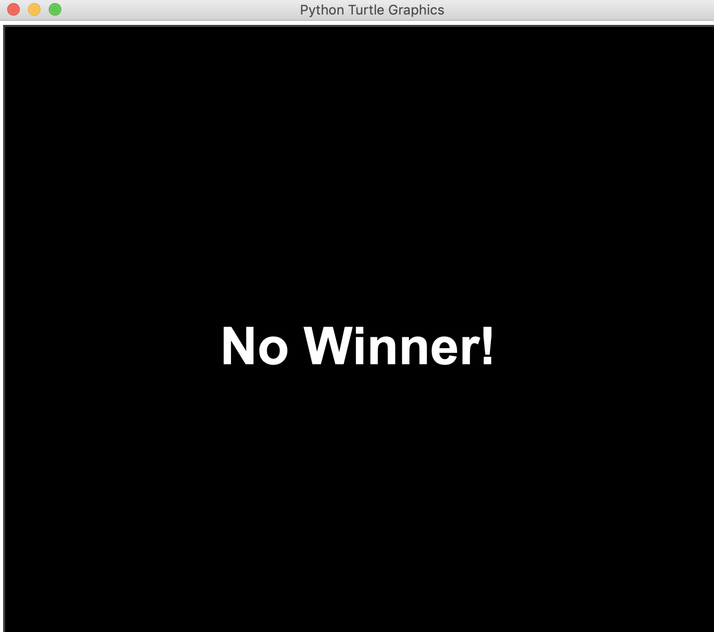

# Python Board Game - Connect Four

## Introduction

It’s a classic old board game that’s a cross between checkers and tic-tac-toe. It’s a two-player game, with each player trying to get 4-in-a-row of their color on the gameboard.
#


## Installation and how to run
1. require python 3
2. Install turtle library
   ```
   $ pip install turtle
   ```
3. git clone the repository
   ```
   $ git clone https://github.com/YiqianDeng/BoardGame-ConnectFour.git
   ```
4. run the file driver.py
   ```
   $ python driver.py
   ```

## How to play
Select board size by rows and columns:
#


#
Select oponent identities to be human or computer
#

#
Place pieces:
#


#
Get a winner:

#
Start another round, score is up:

#
Invalid step error:

#
When two players draw:

